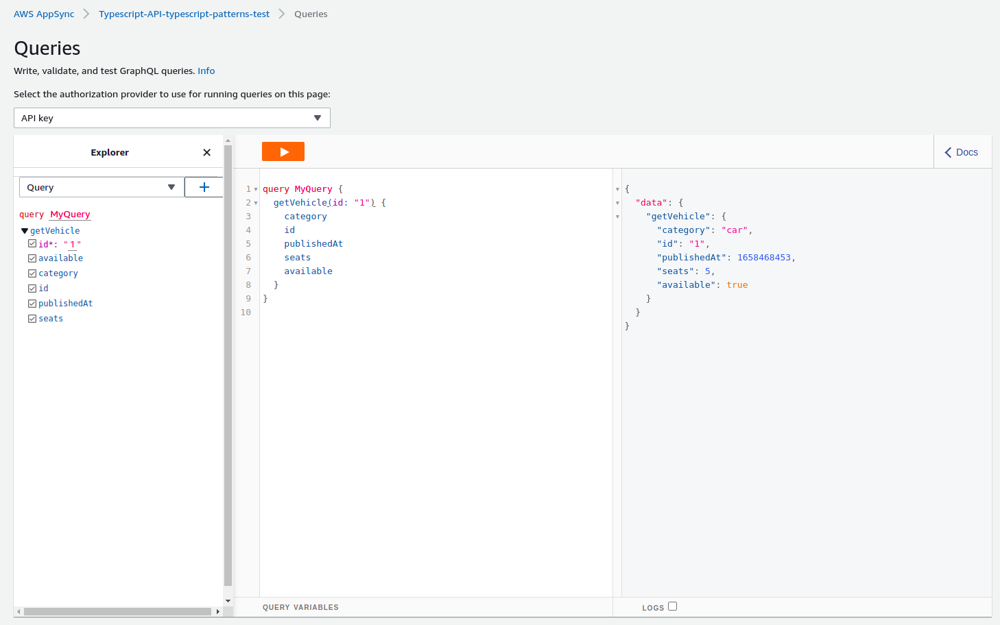

# Typescript Patterns DOJO

This repository contains a basic structure to learn good practices of Typescript, as well as some Design Patterns alongside the AWS SAM framework.

## Prerequisites

In order to follow the challenges from this repository, you need to make sure you have:

* [NodeJS 16x](https://nodejs.org/en/).
* [SAM CLI](https://docs.aws.amazon.com/serverless-application-model/latest/developerguide/serverless-sam-cli-install.html). (Make sure you are using the latest version that supports the NodeJS 16x runtime.)
* [AWS CLI](https://docs.aws.amazon.com/cli/latest/userguide/getting-started-install.html).

Also, make sure you install the dependencies of the project before start developing:

```bash
npm install
```

## Project structure

The repository was initially configured with the following structure:

* `template.yaml`: The SAM template file with all resources from your application.
* `src/appsync`: This directory contains the files used by the AppSync API.
* `src/lambdas`: This directory can be used to store the files of the lambdas. There's already a lambda named `getVehicleLambda` as an example.
* `src/tasks`: The documentation that will be used to guide the DOJO tasks.
* `appsync.d.ts`: This file defines the types to be used by your application based on your schema definition.

This project contains a working example of AppSync with a query named `getVehicle` that gets resolved by a Lambda with Typescript and NodeJS 16x.

After deploying the stack, you'll be able to see the API working, as shown in the image below:



## How to deploy

In order to deploy the application, you can use the following commands:

```bash
# Build the template resources
sam build --template template.yaml --build-dir .aws-sam/build --beta-features

# Pack resources and convert SAM template into a CloudFormation template
sam package --template-file .aws-sam/build/template.yaml --s3-bucket typescript-patterns-dojo-assets --output-template-file .aws-sam/build/packaged-template.yaml

# Create and deploy the CloudFormation stack
sam deploy --template-file .aws-sam/build/packaged-template.yaml --s3-bucket typescript-patterns-dojo-assets --no-fail-on-empty-changeset --stack-name YOUR_STACK_NAME_HERE --capabilities CAPABILITY_IAM CAPABILITY_NAMED_IAM
```

> **Note:** Make sure you change the stack name, so it doesn't conflict with the stack of someone else. Replace `YOUR_STACK_NAME_HERE` with the name of your stack.

## How to generate the types from your Grahpql schema

When updating the file `src/appsync/schema.graphql`, you also want to make sure the type definitions of your application are in sync with the types of your schema.

For convenience, you can execute the following command from the root of the project and the types will be generated in the file `appsync.d.ts` for you:

```bash
npm run generate-schema
```

## Tasks

Here is the list of tasks to be developed in this repository:

* **TASK 1:** [Configure ESLint](./src/tasks/task1.md)
* **TASK 2:** [Configure Jest](./src/tasks/task2.md)
* **TASK 3:** [Configure the Pipeline (CI/CD)](./src/tasks/task3.md)
* **TASK 4:** [Implement the Factory Pattern](./src/tasks/task4.md)
* **TASK 5:** [Implement the Builder Pattern](./src/tasks/task5.md)
* **TASK 5:** [Implement the Singleton Pattern](./src/tasks/task6.md)

