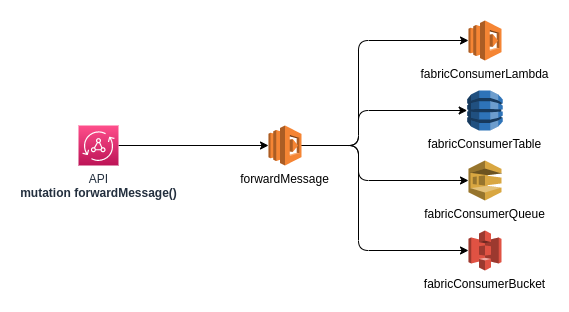

# TASK 4: Implement the Factory Pattern

In this task you'll have the opportunity to apply the design pattern called Factory.

## References

- [**Refactoring Guru - Factory**](https://refactoring.guru/design-patterns/factory-method)

## Context

You are working in a project where a machine is constantly pushing messages to an API in the Cloud. The messages need to take different routes depending on the purpose of the message.

This is how the architecture should look like:



Your job is to implement this API in a way that is easier to scale in case we need to add more types of routes to the messages.

## Specifications

Please follow the instructions below:

1. The API should provide a mutation named `forwardMessage`. This mutation will receive the following attributes:
    * `route`: The route where the message will be forwarded to. The valid routes are: `LAMBDA`, `DYNAMODB`, `SQS` or `S3`.
    * `message`: It will be a string containing a simple message.
2. For all routes, the API will generate a random **uuid** as well as a **lastUpdated** with the current timestamp. The final payload to be forwarded should look like this:
```json
{
  "id": "4aaff49c-521a-483a-b0c3-79418d35cf2f",
  "lastUpdated": 1662386964980,
  "message": "Hi. This is just an example of message."
}
```
3. AVOID using `if` or `switch` statements. Figure out a way to use the pattern without that.
4. If received an invalid route, the API should return status code `400` and the following payload in the response body:
```json
{
  "result": "Invalid route."
}
```
5. If everything went well, the API should return status code `200` and the following payload in the  response body:
```json
{
  "result": "Forwarded successfully."
}
```
6. If something goes wrong, the API should return status code `500` and the following payload in the  response body:
```json
{
  "result": "Something went wrong."
}
```

**Note:** Remember to create unit tests for every possible scenario.

## Testing

You can use the command below to test if your mutation is working as expected:

```bash
curl --location --request POST 'https://YOUR_API_URL.appsync-api.us-east-1.amazonaws.com/graphql' \
--header 'x-api-key: YOUR_API_KEY' \
--header 'Content-Type: application/json' \
--data-raw '{"query":"mutation forwardMessage($route: String!, $message: String!) {\n    forwardMessage(route: $route, message: $message) {\n        message\n    }\n}","variables":{"route":"LAMBDA","message":"A simple forwarder example."}}'
```

Make sure you replace **YOUR_API_URL** with the URL of your API and **YOUR_API_KEY** with the *x-api-key* of your API. Also, feel free to try out with different routes.


[<- Go back](../../README.md)
